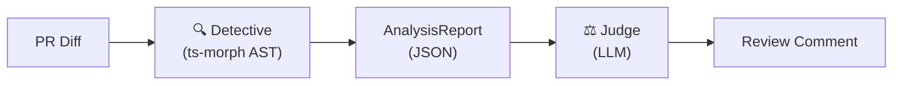

# The Detective Engine (Hybrid Deterministic Analysis)

## Overview

The Detective Engine is a **static analysis layer** that runs **before** the LLM (Judge) in the J Star review pipeline. It extracts **deterministic facts** from code using AST parsing via `ts-morph`, eliminating LLM hallucinations about syntax, imports, and framework rules.



## What It Detects

| Code | Description | Example |
|------|-------------|---------|
| `CLIENT_HOOK_IN_SERVER` | React hooks in Server Components | `useState` without `"use client"` |
| `SERVER_ONLY_IN_CLIENT` | Server-only imports in Client | `import { headers } from 'next/headers'` in client |
| `ASYNC_CLIENT_COMPONENT` | Async function in Client Component | `async function Page()` with `"use client"` |
| `MISSING_USE_CLIENT` | Hooks used without directive | Using `useRouter` without `"use client"` |
| `WRONG_EXPORT_PATTERN` | Route Handler with default export | `export default` instead of `export GET` |

## Architecture

```
src/core/analysis/
├── engine.ts          # Main analysis logic (analyzeFile)
├── types.ts           # Zod schemas for AnalysisReport
├── index.ts           # Public exports
└── utils/
    └── package-parser.ts  # package.json parsing + API hints
```

## Key Files

### `engine.ts`
- `analyzeFile(code, filename, packageJson)` → `AnalysisReport`
- `formatReportsForLLM(reports, projectContext)` → String for prompt injection

### `types.ts`
- `AnalysisReportSchema` - Zod schema for the Detective output
- `ContextViolationSchema` - Individual violation structure
- `FileContextSchema` - Client/Server detection

### `package-parser.ts`
- `parsePackageJson()` - Extract dependencies
- `getApiHints()` - Version-specific API guidance (OpenAI v4, React Query v5, etc.)

## How LLM Grounding Works

The Detective's JSON output is injected into the LLM system prompt:

```
=== DETECTIVE REPORT (GROUND TRUTH - DO NOT CONTRADICT) ===
{
  "file": "app/dashboard/page.tsx",
  "context": { "isServerComponent": true },
  "violations": [
    { "line": 5, "code": "CLIENT_HOOK_IN_SERVER", "symbol": "useState" }
  ]
}
=== END DETECTIVE REPORT ===
```

The Judge is instructed to:
1. **EXPLAIN** each violation (not invent new ones)
2. **ADD** logic/security issues only (things static analysis can't find)
3. **NEVER** contradict the Detective's facts

## Testing

Run the Detective test suite:

```bash
npx tsx test/test-detective.ts
```

Test fixtures in `test/fixtures/`:
- `server-with-hook.tsx` - Should flag `CLIENT_HOOK_IN_SERVER`
- `client-with-server-import.tsx` - Should flag `SERVER_ONLY_IN_CLIENT`
- `route-with-default-export.ts` - Should flag `WRONG_EXPORT_PATTERN`
- `valid-client-component.tsx` - Should flag nothing (control case)

## Determinism Guarantee

The Detective is **100% deterministic**: same input → same output, every time.

This is verified by the test script which runs 5 consecutive analyses and confirms byte-for-byte identical output.
