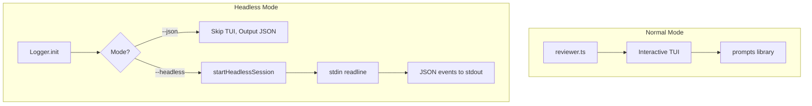

# Feature: AI Headless Mode

> **Status:** ✅ Production Ready  
> **Entry Point:** `scripts/utils/logger.ts`, `scripts/session.ts`

## Overview

J-Star supports two machine-readable modes for AI agents and CI/CD pipelines:
- `--json` — Output review results as JSON to stdout
- `--headless` — Enable stdin/stdout JSON protocol for interactive chat

Both modes route human-readable logs to **stderr**, keeping **stdout** clean for structured data.

## JSON Mode (`--json`)

For CI/CD integration. Runs the full review and outputs `DashboardReport` as JSON.

```bash
jstar review --json > report.json
```

**Behavior:**
- All chalk/ANSI output goes to stderr
- Interactive session is skipped
- Session files (`.jstar/session.json`, `.jstar/last-review.md`) are still saved
- Final report is written to stdout as JSON

**Output Schema:**
```typescript
interface DashboardReport {
  date: string;
  reviewer: string;
  status: 'CRITICAL_FAILURE' | 'NEEDS_REVIEW' | 'APPROVED';
  metrics: { filesScanned, totalTokens, violations, critical, high, medium, lgtm };
  findings: FileFinding[];
  recommendedAction: string;
}
```

---

## Headless Chat Mode (`--headless`)

For AI agents. Enables stdin/stdout JSON protocol.

```bash
echo '{"action": "list"}' | jstar chat --headless
```

### Input Commands (stdin)

One JSON command per line:

| Action | Parameters | Description |
|--------|------------|-------------|
| `list` | — | List all current issues |
| `debate` | `issueId`, `argument` | Challenge an issue with reasoning |
| `ignore` | `issueId` | Mark issue as ignored |
| `accept` | `issueId` | Acknowledge issue (no state change) |
| `exit` | — | End session and get final report |

**Examples:**
```json
{"action": "list"}
{"action": "debate", "issueId": 0, "argument": "This is intentional because utils.ensure() guards it."}
{"action": "ignore", "issueId": 1}
{"action": "exit"}
```

### Output Events (stdout)

| Type | Fields | Description |
|------|--------|-------------|
| `ready` | `issues[]` | Emitted on startup with all issues |
| `list` | `issues[]` | Response to list command |
| `response` | `issueId`, `text`, `verdict` | Debate result (`LGTM` or `STANDS`) |
| `update` | `issueId`, `status` | Issue status changed |
| `error` | `message` | Error description |
| `done` | `hasUpdates`, `updatedFindings[]` | Session ended |

**Examples:**
```json
{"type": "ready", "issues": [{"id": 0, "title": "...", "file": "...", ...}]}
{"type": "response", "issueId": 0, "text": "You're right, utils.ensure() throws.", "verdict": "LGTM"}
{"type": "update", "issueId": 0, "status": "resolved"}
{"type": "done", "hasUpdates": true, "updatedFindings": [...]}
```

---

## Architecture



**Key Files:**
- `scripts/utils/logger.ts` — Mode detection, routing logs to stderr
- `scripts/session.ts` — `startHeadlessSession()` function
- `scripts/chat.ts` — Headless branch in main()
