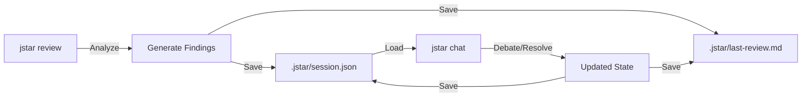

# Feature: Session Persistence & Chat

**Session Persistence allows developers to resume code reviews instantly without re-running the analysis.**

J-Star decouples the **Heavy Analysis** (Diff + RAG + LLM) from the **Interaction** (Debate). This enables a snappy, continuous workflow where the state is preserved across CLI runs.

## How it Works

### 1. Session State (`session.json`)
When `jstar review` completes, it saves the entire state to `.jstar/session.json`.
This file acts as the "Save Game" for the review, containing:
*   **Findings:** The list of issues and their current status (`resolved`, `ignored`, `open`).
*   **Metrics:** Token usage, violation counts.
*   **Metadata:** Date, reviewer signature.

### 2. The `jstar chat` Command
A distinct CLI entry point that skips the "Detective" and "Reviewer" phases.
1.  **Load:** Reads `.jstar/session.json`.
2.  **Resume:** Re-hydrates the interactive menu immediately.
3.  **Sync:** Any changes (resolving/ignoring issues) function exactly like the original session.
4.  **Save:** Updates both `session.json` and the `last-review.md` report on exit.

## Workflow

## Benefits
*   **Zero Latency:** Resuming a chat takes milliseconds.
*   **CI/CD Compatible:** A pipeline can run `review --json` (headless), and a human can pull the artifact and run `chat` locally.
*   **AI Agent Support:** Use `chat --headless` for stdin/stdout JSON protocol. See [Headless Mode](./headless-mode.md).
*   **Continuity:** You don't lose your work if you accidentally close the terminal.

